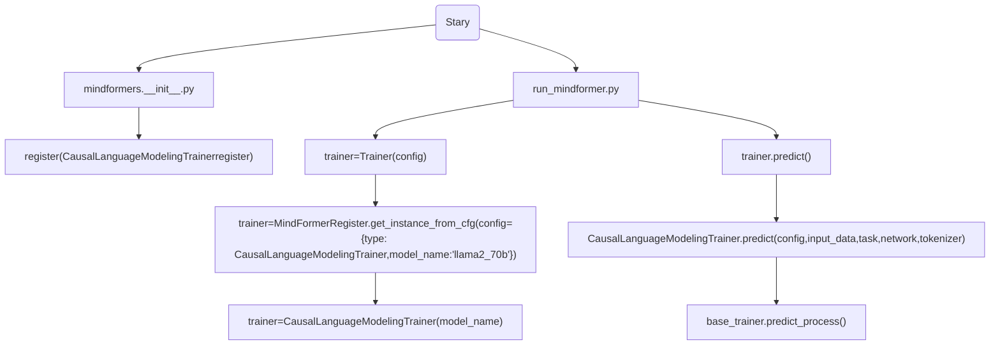
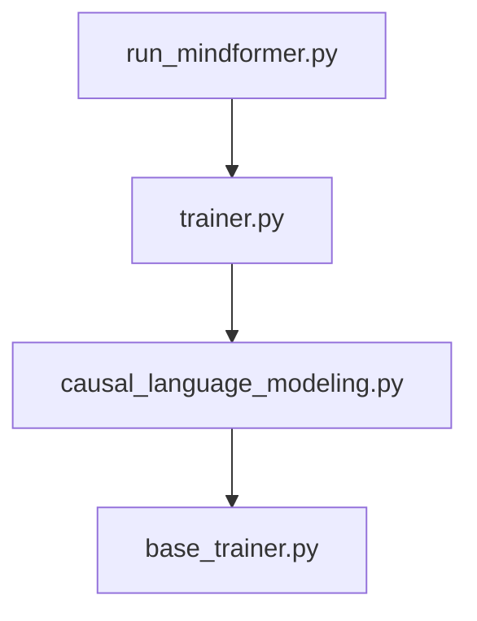

# 

```mermaid
flowchart TB
A(Stary)-->B["mindformers.__init__.py"]
B --> C["register(CausalLanguageModelingTrainerregister)"]
A --> D[run_mindformer.py]
D --> E["trainer=Trainer(config)"]
E --> F["trainer=MindFormerRegister.get_instance_from_cfg(config={type: CausalLanguageModelingTrainer,model_name:'llama2_70b'})"] 
F --> G["trainer=CausalLanguageModelingTrainer(model_name)"]
D --> H["trainer.predict()"]
H --> I["CausalLanguageModelingTrainer.predict(config,input_data,task,network,tokenizer)"]
I --> J["base_trainer.predict_process()"]
```

predict_process里创建pipeline，pipeline调用的是task。

```mermaid
flowchart TB
run_mindformer.py --> trainer.py --> causal_language_modeling.py --> base_trainer.py
```

构建网络使用的是config.model的配置，核心逻辑在`base_trianer.py`的`create_network`函数里。

